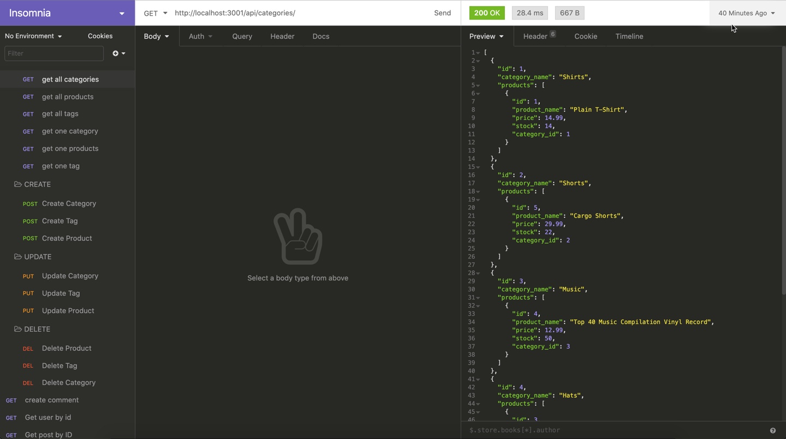

# E-commerce-Back-End

## Description
This is a back end application for an internet retail company's e-commerce website that uses the latest technologies



<a href="https://github.com/heather-everton/E-commerce-Back-End"><strong>Explore the docs »</strong></a>
<br />
<a href="https://drive.google.com/file/d/1YsDQYfdQCFRpCYRHzmTErwmqUZ1s-kFU/view?usp=sharing">View Demo</a>

## Table of Contents
* [Installation](#installation)
* [Usage](#usage)
* [Contributing](#contributing)
* [Tests](#tests)
* [Questions](#questions)


## Installation
To install necessary dependencies, run the following command:
```
npm install
npm install express --save
npm install --save mysql2
npm install --save sequelize
npm install dotenv

```
## Usage
    This will use mysql2 and sequalize and be able to execute full CRUD routes to manage a database of products, categories, tags, and product-tags. 

## Contributing
If you're interested in contributing please reach out to me via email. 

## Tests
Test this application manually

## Questions
If you have any questions about the repo, open an issue or contact me directly at heathereverton88@gmail.com. You can find more of my work at (https://github.com/heather-everton/).

### Built With
* [npm](https://www.npmjs.com/)
* [express](https://expressjs.com/)
* [mysql2](https://www.npmjs.com/package/mysql2)
* [sequelize](https://sequelize.org/)
* [dotenv](https://www.npmjs.com/package/dotenv)


## Roadmap

See the [open issues](https://github.com/heather-everton/E-commerce-Back-End/issues) for a list of proposed features (and known issues).